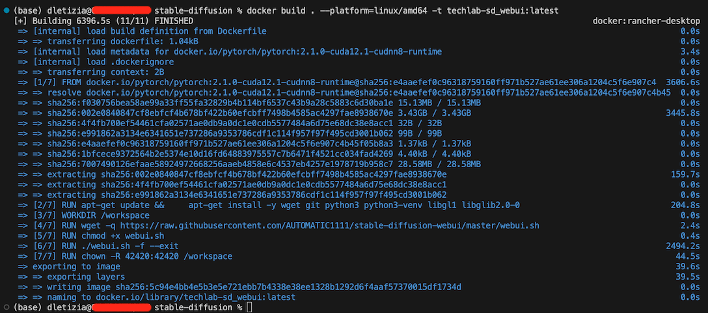

AI Deploy - Tutorial - Deploy Stable Diffusion WebUI
====================================================

Ref. https://github.com/ovh/ai-training-examples/tree/main/apps/gradio/stable-diffusion


# OVHAI's user Info and Config

## Esportiamo i token e le credenziali come variabili di ambiente

```zsh
source scripts/ovhrc.sh
```

```zsh
ovhai me

Name:       user-CEudYCEMj5Dp
Quotas:
  Resources:
    CPU: 4000
    GPU: 200
  Storage:   9.1 TiB
Tenant:     f8aba0da1d094462afbb3d02e450b076
Token Kind: oauth
Trust Id:   72fb3cb381d64bc4a9be18372c51e7ea
```

# Build a local Docker image for x84_64 architecture

## Dockerfile

```dockerfile
# 🐳 Base image
FROM pytorch/pytorch:2.1.0-cuda12.1-cudnn8-runtime

# 🚫 Remove interactivity since using the base image will ask for a timezone - This allows to not provide it
ENV DEBIAN_FRONTEND=noninteractive

# 📚 Install missing system packages (git, libgl1, ..., are needed for Stable Diffusion and are not installed in the base image)
RUN apt-get update && \
    apt-get install -y wget git python3 python3-venv libgl1 libglib2.0-0

# 👱 Set the working directory inside the container
WORKDIR /workspace

# 📥 Download the webui.sh script from the specified URL
RUN wget -q https://raw.githubusercontent.com/AUTOMATIC1111/stable-diffusion-webui/master/webui.sh

# 👮‍♀️ Make the webui.sh script executable
RUN chmod +x webui.sh

# ⌛️ Install the webui.sh file (--exit parameter allows to only install it without without running it)
RUN ./webui.sh -f --exit

# 🔑 Give correct access rights to the OVHcloud user
RUN chown -R 42420:42420 /workspace
ENV HOME=/workspace

```

## Build

```zsh
docker build . --platform=linux/amd64 -t techlab-sd_webui:latest
```


> It took 6400 seconds (on a macbook air m1) for cross-building from arm64 to amd64 architecture.
>
> Don't forget this container image contains our models to be served by SD WebUI. So, it's heavy


# Push the local built image into a container registry (OVHAI SHARED)

## Get the container registry URL

```zsh
ovhai registry list

ID KIND   URL
   SHARED registry.gra.ai.cloud.ovh.net/f8aba0da-1d09-4462-afbb-3d02e450b076
```

## Login to the container registry

`docker login -u <user> -p <password> <shared-registry-address>`
```zsh
docker login -u $MY_OVHAI_OPERATOR_USERNAME -p $MY_OVHAI_OPERATOR_PASSWOR registry.gra.ai.cloud.ovh.net/f8aba0da-1d09-4462-afbb-3d02e450b076
```

## Tag the local built image with the container registry

`docker tag techlab-sd_webui:latest <shared-registry-address>/techlab-sd_webui:latest`
```zsh
docker tag techlab-sd_webui:latest registry.gra.ai.cloud.ovh.net/f8aba0da-1d09-4462-afbb-3d02e450b076/techlab-sd_webui:latest
```

## Push the local built and tagged image to the container registry

`docker push <shared-registry-address>/techlab-sd_webui:latest`
```zsh
docker push registry.gra.ai.cloud.ovh.net/f8aba0da-1d09-4462-afbb-3d02e450b076/techlab-aideploy-hello-world:latest

```

# Deploy our container image as AI Deploy app

Once your image has been pushed, it can be used to deploy new AI Solutions.

Run the following command to deploy your Stable Diffusion application by running your customized Docker image:

```bash
ovhai app run <shared-registry-address>/techlab-sd_webui:latest \
    --name stable-diffusion-webui \
    --gpu 1 \
    --default-http-port 7860 \
   * --volume stable_diff_checkpoints@GRA:/workspace/stable-diffusion-webui/models/:rw \
    -- bash -c './webui.sh --xformers --enable-insecure-extension-access --listen --api'

```
