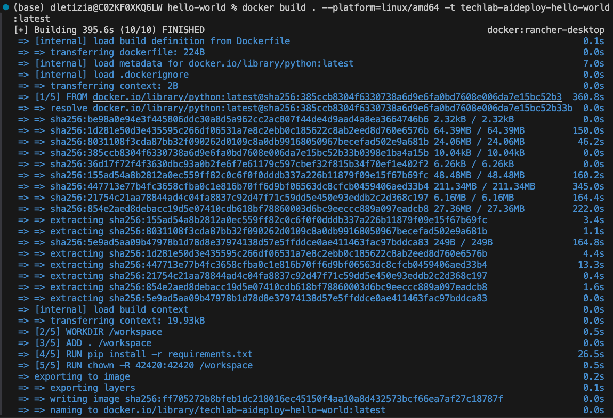
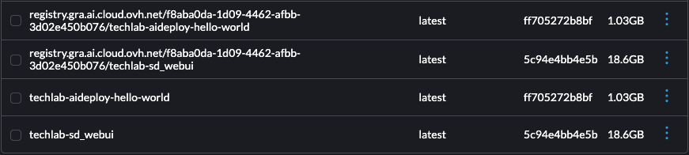

# AI Deploy - Tutorial - Deploy a simple app with Flask
=======================================================

Ref. Direct link to the full Dockerfile can be found here [here](https://github.com/ovh/ai-training-examples/blob/main/apps/flask/hello-world/Dockerfile)


# OVHAI's user Info and Config

## Esportiamo i token e le credenziali come variabili di ambiente

```zsh
source scripts/ovhrc.sh
```

```zsh
ovhai me

Name:       user-CEudYCEMj5Dp
Quotas:
  Resources:
    CPU: 4000
    GPU: 200
  Storage:   9.1 TiB
Tenant:     f8aba0da1d094462afbb3d02e450b076
Token Kind: oauth
Trust Id:   72fb3cb381d64bc4a9be18372c51e7ea
```

# Dev a simple Flask app in Python

## app.py

```python
from flask import Flask

# creating flask app
app = Flask(__name__)

@app.route('/')
def index():
  return 'Web App with Python Flask using AI Training!'

if __name__ == '__main__':
  # starting app
  app.run(debug=True,host='0.0.0.0')

```
## requirements.py

```txt
Flask==1.1.2

```

# Build a local Docker image for x84_64 architecture

## Dockerfile

```dockerfile
FROM python

WORKDIR /workspace

ADD . /workspace

RUN pip install -r requirements.txt

CMD [ "python" , "/workspace/app.py" ]

RUN chown -R 42420:42420 /workspace

ENV HOME=/workspace

```

## Build

```zsh
docker build . --platform=linux/amd64 -t techlab-helloworld-cpu:latest
```

> It took 400 seconds (on a macbook air m1) for cross-building from arm64 to amd64 architecture.



# Push the local built image into a container registry (OVHAI SHARED)

## Get the container registry URL

```zsh
ovhai registry list

ID KIND   URL
   SHARED registry.gra.ai.cloud.ovh.net/f8aba0da-1d09-4462-afbb-3d02e450b076
```

## Login to the container registry

`docker login -u <user> -p <password> <shared-registry-address>`
```zsh
docker login -u $MY_OVHAI_OPERATOR_USERNAME -p $MY_OVHAI_OPERATOR_PASSWOR registry.gra.ai.cloud.ovh.net/f8aba0da-1d09-4462-afbb-3d02e450b076
```

## Tag the local built image with the container registry

`docker tag techlab-helloworld-cpu:latest <shared-registry-address>/techlab-helloworld-cpu:latest`
```zsh
docker tag techlab-helloworld-cpu:latest registry.gra.ai.cloud.ovh.net/f8aba0da-1d09-4462-afbb-3d02e450b076/techlab-helloworld-cpu:latest
```

## Push the local built and tagged image to the container registry

`docker push <shared-registry-address>/techlab-helloworld-cpu:latest`
```zsh
docker push registry.gra.ai.cloud.ovh.net/f8aba0da-1d09-4462-afbb-3d02e450b076/techlab-helloworld-cpu:latest

```

# Deploy our container image as AI Deploy app

Once your image has been pushed, it can be used to deploy new AI Solutions.

Run the following command to deploy your Stable Diffusion application by running your customized Docker image:

```bash
ovhai app run <shared-registry-address>/techlab-helloworld-cpu:latest \
--cpu 1 \
--default-http-port 5000

```
```bash
ovhai app run registry.gra.ai.cloud.ovh.net/f8aba0da-1d09-4462-afbb-3d02e450b076/techlab-helloworld-cpu:latest \
  --name techlab-helloworld-cpu-x1 \
  --label techlab/cpu=hello-world \
  --label techlab/ai_deploy_token=_techlab_my_operator_token \
  --cpu 1 \
  --default-http-port 5000
  --unsecure-http

```


https://810f86a5-f907-474c-9025-b88774042dba.app.gra.ai.cloud.ovh.net