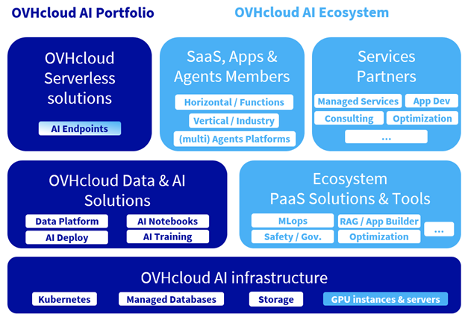

Tech Lab
========



**IA in Azione: sicura e performante**

> v2025.04.09


# DEMO

**🚀 un unico comando per distribuire e servire un LLM 🚀**

> Ispirato da alcuni recenti articoli, come quello pubblicato da [Eléa](https://blog.ovhcloud.com/mistral-small-24b-served-with-vllm-and-ai-deploy-one-command-to-deploy-llm/) o da [Fabien](https://blog.ovhcloud.com/deep-dive-into-deepseek-r1-part-1/) sul [blog di OVHcloud](https://blog.ovhcloud.com).

## Introduzione

Sì, è possibile distribuire e servire un LLM open source in un'unica riga di comando.

E lo faremo implementando il modello **Mistral-Small-24B-Instruct-2501** utilizzando _vLLM_ sulla piattaforma [*AI Deploy*](https://www.ovhcloud.com/it/public-cloud/ai-deploy/) parte delle soluzioni IA di OVHcloud.

Questa combinazione offre una soluzione efficiente e scalabile per distribuire e servire i modelli IA.

Mettere in opera un modello è fantastico, ma farlo rapidamente è ancora meglio!

🤯 se una singola riga di comando fosse sufficiente? Questa è la sfida che stiamo affrontando oggi!


## Contesto

Prima di procedere con l’implementazione, esaminiamo attentamente le nostre tecnologie chiave!

### Mistral Small

Il modello **mistralai/Mistral-Small-24B-Instruct-2501** è stato istruito con 24 miliardi di parametri, è rinomato per le sue dimensioni compatte e le prestazioni paragonabili ai modelli più grandi.

Questo modello, di MistralAI, è una versione con istruzioni precise del modello base: [Mistral-Small-24B-Base-2501](https://huggingface.co/mistralai/Mistral-Small-24B-Base-2501).

Per gestire questo modello in modo efficiente, utilizzeremo vLLM, una libreria open source per l’**inferenza LLM**.


### vLLM

(Virtual LLM) [vLLM](https://docs.vllm.ai/en/latest/) è un motore di servizio altamente ottimizzato e progettato per eseguire in modo efficiente modelli di linguaggio di grandi dimensioni. Sfrutta diverse ottimizzazioni chiave, come:
- **Paged Attention**: un meccanismo di attenzione che riduce la frammentazione della memoria e consente un utilizzo più efficiente della memoria GPU
- **Continuous Batching**: vLLM regola dinamicamente le dimensioni dei batch in tempo reale, assicurando che la GPU sia sempre utilizzata in modo efficiente, anche con richieste multiple simultanee
- **Tensor parallelism**: consente l'inferenza dei modelli su più GPU per migliorare le prestazioni
- **Optimized kernel implementations**: vLLM utilizza kernel CUDA personalizzati per un’esecuzione più rapida, riducendo la latenza rispetto ai framework di inferenza tradizionali

Queste caratteristiche rendono vLLM una delle migliori soluzioni per i modelli di grandi dimensioni, come Mistral Small 24B, abilitando bassa latenza e alta capacità di elaborazione sulle più recenti GPU.

Scegliendo di distribuire il server vLLM sulla piattaforma AI Deploy di OVHcloud, è possibile servire questo modello in un’unica riga di comando.


### AI Deploy

OVHcloud AI Deploy è una piattaforma **Container as a Service** (CaaS) progettata per aiutare gli utenti di eseguire, gestire e scalare modelli di IA. Fornisce una soluzione che consente di implementare in modo ottimale applicazioni/API basate su Machine Learning (ML), Deep Learning (DL) o LLM.

I principali vantaggi sono:
- **Facile da usare**: crea un'immagine Docker personalizzata e la distribuisci in riga di comando o in pochi click
- **High Performance Computing**: una gamma completa di GPU disponibili (H100, A100, V100S, L40S e L4)
- **Scalabilità e flessibilità**: supporta la scalabilità automatica, consentendo al modello di gestire efficacemente carichi di lavoro fluttuanti
- **Convenienza**: fatturazione al minuto e senza maggiorazioni


✅ Per andare oltre, alcuni prerequisiti devono essere verificati!


## Requisiti

Prima di iniziare, assicuriamoci di avere:

- **OVHcloud account**: accesso allo Spazio Cliente OVHcloud [_manager_](https://www.ovh.com/auth/?action=gotomanager&from=https://www.ovh.co.uk/&ovhSubsidiary=GB)
- **ovhai CLI disponibile**: installa l'[ovhai CLI]()
- **Accesso AI Deploy**: assicurarsi di disporre di un utente per AI Deploy
- **Accesso Hugging Face**: crea un account Hugging Face e genera un token di accesso
- **Autorizzazione Hugging Face per i modelli Gated**: accertarsi di aver ottenuto l'accesso al modello Mistral-Small-24B-Instruct-2501

🚀 Avendo a disposizione tutti gli ingredienti per la nostra ricetta, è arrivato il momento di iniziare!


## Soluzione

Prima di dedicarci alla messa in opera - _aka deploy_ - del modello **mistralai/Mistral-Small-24B-Instruct-2501** è arrivato il momento di gestire il [token Hugging Face](https://huggingface.co/settings/tokens) ed esportarlo come variabile di ambiente

> ### Sicurezza e Privacy
>
> Con un token di accesso puoi distribuire il modello in sicurezza, servito privatamente _by-design_ e disponibile per l'inferenza solo agli operatori autorizzati.
>
> Creiamo un token specifico per tutte le applicazioni a cui applicheremo la seguente etichetta o _label_, feature inclusa e disponibile con la piattaforma ovhai 
> ```bash
> ovhai token create --role operator techlab/ai_deploy_token=_techlab_my_operator_token
> ```
> ed esportiamo il valore restituito come variabile d'ambiente


Qualora non lo avessimo già fatto, esportiamo le variabili di ambiente per HF e AI Deploy.
```bash
export MY_HF_TOKEN=hf_xxxxxxxxxxxxxx
```
```bash
export MY_OVHAI_ACCESS_TOKEN=<IL-TOKEN-A-TE-RESTITUITO>
```

Siamo quindi pronti ad avviare il modello **Mistral-Small-24B** utilizzando vLLM e servirlo con AI Deploy in un unico comando :-)

```bash
ovhai app run \
    --name techlab-ai-vllm-mistral-small \
    --default-http-port 8000 \
    --label techlab/vllm=mistral \
    --label techlab/ai_deploy_token=_techlab_my_operator_token \
    --gpu 2 \
    --flavor l40s-1-gpu \
    -e OUTLINES_CACHE_DIR=/tmp/.outlines \
    -e HF_TOKEN=<your_hf_token> \
    -e HF_HOME=/hub \
    -e HF_DATASETS_TRUST_REMOTE_CODE=1 \
    -e HF_HUB_ENABLE_HF_TRANSFER=0 \
    -v standalone:/hub:rw \
    -v standalone:/workspace:rw \
    vllm/vllm-openai:latest \
    -- bash -c "python3 -m vllm.entrypoints.openai.api_server \
        --model mistralai/Mistral-Small-24B-Instruct-2501 \
        --tensor-parallel-size 2 \
        --tokenizer_mode mistral \
        --load_format mistral \
        --config_format mistral \
        --dtype half"

```
**Come capire i diversi parametri di questo comando?**

1. Avvia l'app AI Deploy
    
    Avvia una nuova app utilizzando la CLI di ovhai e assegna un nome
    **```ovhai app run --name techlab-ai-vllm-mistral-small```**

2. Definire l'accesso
    
    Definire la porta HTTP per l'API server e limitare l'accesso tramite token
    ```--default-http-port 8000```
    ```--label ai_deploy_token=my_operator_token```

3. Configurare le risorse GPU
    
    Specifica la tipologia hardware (l40s-1-gpu), che fa riferimento a una GPU NVIDIA L40S e il loro numero (2).
    ```--gpu 2```
    ```--flavor L40S-1-GPU```

    > **⚠️ ATTENZIONE !**
    > Per questo modello sono sufficienti due L40S, ma se si desidera implementare un altro modello, è necessario verificare di quale GPU si ha bisogno. È inoltre possibile accedere alle GPU A100 e H100 per i modelli più grandi.

4. Impostare le variabili di ambiente

    Configuriamo la memorizzazione nella cache per la **libreria Outlines** (utilizzata per la generazione efficiente del testo):
    ```-e OUTLINES_CACHE_DIR=/tmp/.outlines```

    Passiamo il **token** per l'autenticazione e il download del modello da **Hugging Face**:
    ```-e HF_TOKEN=<your_hf_token>```

    Impostiamo la **directory della cache Hugging Face** su /hub (dove verranno memorizzati i modelli):
    ```-e HF_HOME=/hub```

    Consentiamo l'esecuzione di **codice remoto personalizzato** da set di dati Hugging Face (necessario per alcuni comportamenti del modello):
    ```-e HF_DATASETS_TRUST_REMOTE_CODE=1```

    Disabilitiamo l'accelerazione Hugging Face Hub (per utilizzare il download di modelli standard):
    ```-e HF_HUB_ENABLE_HF_TRANSFER=0```

5. Monta i volumi persistenti
    Montiamo **due volumi di archiviazione persistenti**:
    - _/hub_ → Dove memorizzare i file per i modelli Hugging Face
    - _/workspace_ → Cartella di lavoro principale

    Il flag _rw_ indica l'**accesso in lettura e scrittura**.

    ```-v standalone:/hub:rw```
    ```-v standalone:/workspace:rw```

6. Scegli l'immagine docker

    Utilizziamo l’immagine Docker _vllm/vllm-openai:latest_ (un server vLLM preconfigurato per servire il modello e compatibile le API di OpenAI).

    **```vllm/vllm-openai:latest```**

7. Esecuzione del modello all'interno del container

    Invochiamo una **shell bash** all’interno del container ed eseguiamo un comando Python per avviare il server API vLLM:

    > - _**python3 -m vllm.entrypoints.openai.api_server**_ → Avvia il modulo python vLLM che esponga un api server compatibile con OpenAI
    > - _**--model mistralai/Mistral-Small-24B-Instruct-2501**_ → Carica il modello Mistral Small 24B (by default da Hugging Face)
    > - _**--tensor-parallel-size 2**_ → Distribuisce il modello su 2 GPU
    > - _**--tokenizer_mode mistral**_ → Utilizza il tokenizer Mistral
    > - _**--load_format mistral**_ → Utilizza il formato di caricamento del modello di Mistral
    > - _**--config_format mistral**_ → Assicura che la configurazione del modello segua lo standard di Mistral
    > - _**--dtype half**_ → Utilizza FP16 (half-precision floating point) per prestazioni GPU ottimizzate

Ora puoi verificare se la tua app AI Deploy è attiva:
```bash
ovhai app get <your_vllm_app_id>
```

**💡Lo stato dell'app è _RUNNING_ ?** Perfetto! È possibile verificare nei log lo stato del server e se è stato avviato con successo...
```bash
ovhai app logs <your_vllm_app_id>
```

> **⚠️ ATTENZIONE !**
>> This step may take a little time as the template must be loaded…
>> After a few minutes, you should get the following information in the logs:

🚦 Tutti gli indicatori sono verdi? Allora siamo pronti a inferenziare il modello!


Richiedi e invia prompt al servizio LLM

Eseguire la seguente richiesta ponendo la domanda desiderata:
```bash
curl https://<your_ovhai_app_id>.app.gra.ai.cloud.ovh.net/v1/chat/completions \
    -H "Authorization: Bearer <your_ovhai_app_token>" \
    -H "Content-Type: application/json" \
    -d '{
        "model": "mistralai/Mistral-Small-24B-Instruct-2501",
        "messages": [
            {"role": "system", "content": "You are a helpful assistant."},
            {"role": "user", "content": "Give me the name of OVHcloud’s founder."}
        ],
        "stream": false
    }'

```

```bash
#export OVHAI_APP_ID_MISTRAL=ce566c85-a989-4294-8d40-8b035d5f3e32 && \
export OVHAI_APP_ID_MISTRAL=11c0ef55-6b44-4a12-9875-7ef89b437ae6 && \
curl https://$OVHAI_APP_ID_MISTRAL.app.gra.ai.cloud.ovh.net/v1/chat/completions \
    -H "Authorization: Bearer $MY_OVHAI_ACCESS_TOKEN" \
    -H "Content-Type: application/json" \
    -d '{
        "model": "mistralai/Mistral-Small-24B-Instruct-2501",
        "messages": [
            {"role": "system", "content": "You are a helpful assistant."},
            {"role": "user", "content": "Give me the name of OVHcloud’s founder."}
        ],
        "stream": false
    }'
```

Ritorna il seguente risultato
```json
{
    "id":"chatcmpl-5817e2febf86fda42b99328954485940",
    "object":"chat.completion",
    "created":1741521522,
    "model":"mistralai/Mistral-Small-24B-Instruct-2501",
    "choices":[{
        "index":0,
        "message":{
            "role":"assistant",
            "reasoning_content":null,
            "content":"The founder of OVHcloud is Octave Klaba. He started the company in 1999, and it has since grown to become one of the world's leading cloud service providers.",
            "tool_calls":[]
        },"logprobs":null,
        "finish_reason":"stop",
        "stop_reason":null
    }],
    "usage":{
        "prompt_tokens":22,
        "total_tokens":63,
        "completion_tokens":41,
        "prompt_tokens_details":null
    },
    "prompt_logprobs":null
}
```

Seguendo questi step, hai implementato con successo il modello **mistralai/Mistral-Small-24B-Instruct-2501** utilizzando **vLLM** sulla piattaforma AI Deploy di OVHcloud. Questa configurazione fornisce una soluzione scalabile ed efficiente per offrire modelli linguistici avanzati in ambienti di produzione.

Per ulteriori personalizzazioni e ottimizzazioni, fare riferimento alla [documentazione vLLM(https://docs.vllm.ai/en/latest/deployment/docker.html) e alle [risorse OVHcloud AI Deploy](https://help.ovhcloud.com/csm/en-ie-documentation-public-cloud-ai-and-machine-learning-ai-deploy?id=kb_browse_cat&kb_id=574a8325551974502d4c6e78b7421938&kb_category=3241efc6a052d910f078d4b4ef43651f&spa=1).

💪 Vuoi una semplicità ancora maggiore? Con [AI Endpoint](https://endpoints.ai.cloud.ovh.net/) è inoltre possibile utilizzare API pronte all’uso!

>
> Per altri modelli o casi d'uso approfondisci _**DEV.md**_
>
